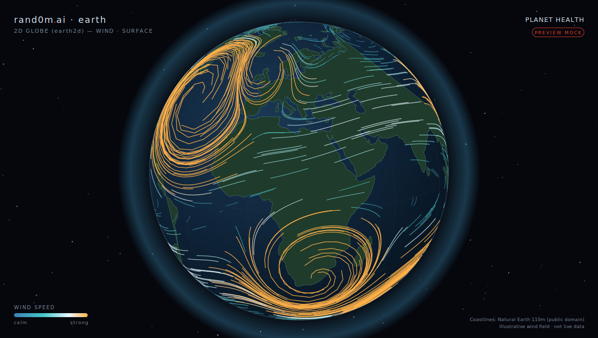
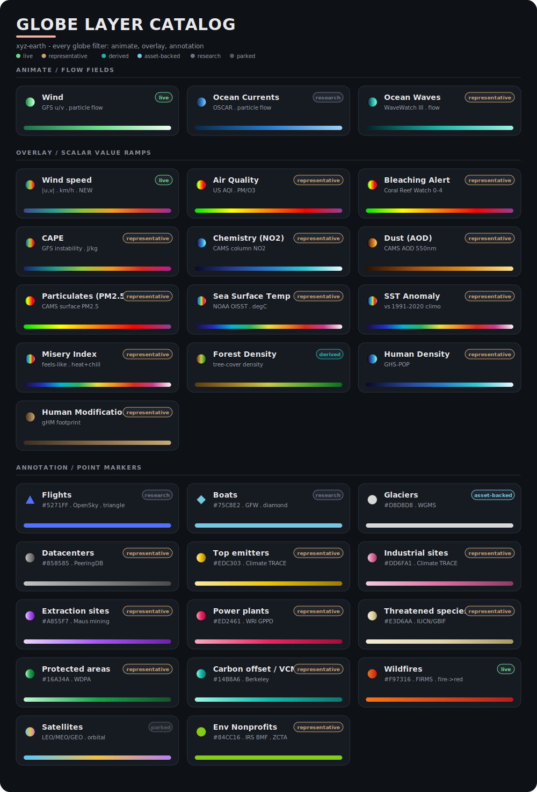

<!-- PROJECT LOGO -->
<br />
<div align="center">
  <picture>
    
  </picture>
<h3 align="center" style="color:#ff4124">Random Knights, XYZ</h3>
  <p align="center">
    rand0m.ai & randomly.engineering
    <br />
    <a href="https://github.com/random-knights/.github/blob/main/READMORE"><strong>Explore the docs »</strong></a>
    <br />
    <br />
    <a href="https://github.com/random-knights/xyz">View Demo</a>
    ·
    <a href="https://github.com/random-knights/123/issues">Report Bug</a>
    ·
    <a href="https://github.com/random-knights/123/issues">Request Feature</a>
  </p>
</div>

# xyz-earth

> The living globe for [rand0m.ai](https://rand0m.ai) — **keyless, open-source, clone-and-run.**

A self-contained Flutter web app that renders Earth's real environmental signals
as an animated globe with a **Planet Health Score**. It reads public rand0m.ai
Storage over plain HTTPS and ships with bundled representative data, so it
**always renders offline** — **no keys, no auth, no Firebase, no private
dependencies.**

<div align="center">

[](preview/earth2d-wind-globe.html)

<sub><b>2D globe (<code>earth2d</code>) — wind layer.</b> Static preview · <a href="preview/earth2d-wind-globe.html"><b>open the interactive mock »</b></a> (drag to rotate). Illustrative wind field — not live data.</sub>

</div>

---

## Run it (60 seconds)

**Prerequisites:** the [Flutter SDK](https://docs.flutter.dev/get-started/install)
(stable, Dart ≥ 3.6) and Chrome.

One command from a fresh clone:

```bash
git clone https://github.com/random-knights/xyz-earth.git && cd xyz-earth && flutter run -d chrome
```

(`flutter run` fetches dependencies itself; no accounts, no keys, no `.env`.)

That's the whole setup. The globe boots from bundled representatives and upgrades
to live data wherever a public rand0m.ai Storage object exists — there is nothing
to configure and no secret to provide.

Build a static bundle (e.g. to host or to attach to a Release):

```bash
flutter build web
# output in build/web/
```

### What you can do

- Toggle an **Animate** layer (wind / ocean currents / waves), a scalar
  **Overlay** (SST, air quality, forest, …), and a **Points** layer (wildfires,
  glaciers, power plants, …).
- Read the **Planet Health Score** ring (global) and open the **History** panel
  for the daily score over time.
- **HD** raises the flow-field particle budget; **Spin** auto-rotates the globe.

---

## How it stays keyless

The viewer reads the public rand0m.ai Storage bucket directly:

```
https://storage.googleapis.com/randomknights-xyz.firebasestorage.app/<object>
```

- **Score:** `earth/score/health-score.json` · history `earth/score/health-history.json`
- **Scalar grids** (`earth.scalarfield.v1`): `earth/<layer>/...-grid.json`
- **Point sets** (`earth.pointset.v1`, identity-stripped): wildfire, biodiversity, …

Each source tries the public live object and, on **any** failure (offline, a
not-yet-deployed object, a non-public 403), falls back to the **bundled
representative** asset under `assets/earth/`. The app never crashes and never
blocks on auth. A `live-ready` manifest skips fetches for objects known to be
undeployed, and every live fetch has a timeout.

> The score math is **frozen at v0.7** (owner-ratified). This app only reads and
> displays the score document — it never recomputes or alters it.

---

## Planet Health Score — v0.7

A single number per region and globally, blending nine Earth-system domains. It
is an estimate, not a certified assessment; every signal carries a confidence
label.

| Domain | What it measures | Primary source |
| --- | --- | --- |
| **Land** | Tree-cover health, forest loss rate | GLAD Hansen / VCF5KYR |
| **Fire** | Active hotspot burden, 24 h window | NASA FIRMS |
| **Atmosphere** | Air-quality burden, AQI-weighted | CAMS |
| **Ocean temperature** | SST anomaly vs 1991–2020 WMO baseline | NOAA OISST / Open-Meteo Marine |
| **Ocean acidification** | pH trend stress signal | _(open for proposals)_ |
| **Cryosphere** | Sea-ice extent and anomaly | _(expanding)_ |
| **Biodiversity** | Species pressure / habitat integrity proxy | GBIF |
| **Conservation** | Protected-area coverage signal | IUCN / WDPA |
| **Anthroposphere** | Human-pressure index (gHM-grounded) | Global Human Modification index |

Domains are anchored against **planetary boundary thresholds** (Rockström et al.).
Signals within a domain are averaged; each domain contributes once to the global
score. Normalizers are locked at ratification (anchored), not floating with
observed ranges.

v0.7 adds two honesty refinements: **protected-areas de-saturation** (coverage is
scored on a saturating curve that treats the 30×30 target as a safe floor, not a
perfect score) and a **humility ceiling** (every domain's health is softly
compressed above 90 so no domain can ever read as a "solved" 100). The bundled
representative asset mirrors the live v0.7 document and is guarded against
methodology drift by `test/score_asset_drift_guard_test.dart`.

---

## Layer catalog

Every globe filter — **Animate** (flow), **Overlay** (scalar value-ramps), and **Annotation** (point markers) — with its live status and the exact palette the renderer uses:

<div align="center">



</div>

The newest annotation layer is **Environmental Nonprofits** (US): the IRS Exempt
Organizations Business Master File located via US Census ZCTA ZIP centroids,
both US-government public domain (attribution as courtesy, no share-alike). Like
every bundled layer it ships a representative offline sample (organizations
aggregated to coarse ZIP-code areas, never named) and upgrades to live data when
the nonprofits ingest publishes its snapshot.

---

## Governance

Everything you see is **aggregated** and **identity-free** by design:

- No callsigns, vessel names, tail numbers, registrations, or personal
  identifiers — ever. Identity suppression is a property of the data, not a
  display-time filter.
- No precise sensitive locations. Ambient mobility layers (flights, boats) are
  decimated and rendered non-interactive (flow, not followable targets).
- Open scientific sources only, each carrying its provider's license.

Contributors must keep this bar — see [CONTRIBUTING.md](CONTRIBUTING.md) and
the [Code of Conduct](CODE_OF_CONDUCT.md). The
`test/keyless_guard_test.dart` gate proves the tree stays free of secrets, auth
SDKs, and private dependencies.

---

## Join the research

[**Discussions →**](../../discussions) — score methodology, data-source
proposals, license questions, and layer requests.

---

## License & attribution

- **Code:** [MIT](LICENSE).
- **Methodology & governance docs:** CC BY 4.0.
- **Brand assets** (the rand0m logo/header, brand colours beyond the few inlined
  UI tokens): **reserved, not covered by the MIT code license** — see
  [`NOTICE`](NOTICE). The app's runtime does not depend on the brand logo.
- **Upstream data & bundled third-party code:** each carries its provider's
  license — see [`NOTICE`](NOTICE) (NOAA, NASA, CAMS, GLAD, IUCN/WDPA, Natural
  Earth, gHM, WRI, d3/topojson, …).

## Operating this repo

- [RUNBOOK.md](RUNBOOK.md) - humans: how to ship a Release, roll back, why this
  repo is keyless, what breaks and how to fix it.
- [CODEX.md](CODEX.md) - agents: the rules that apply in this repo.
