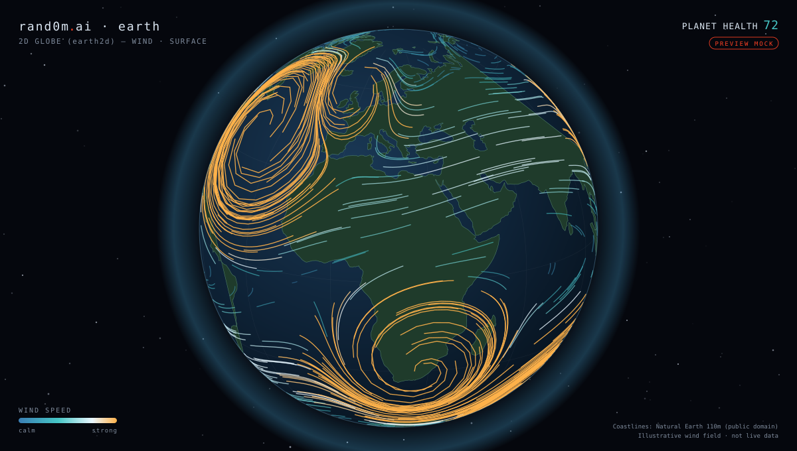
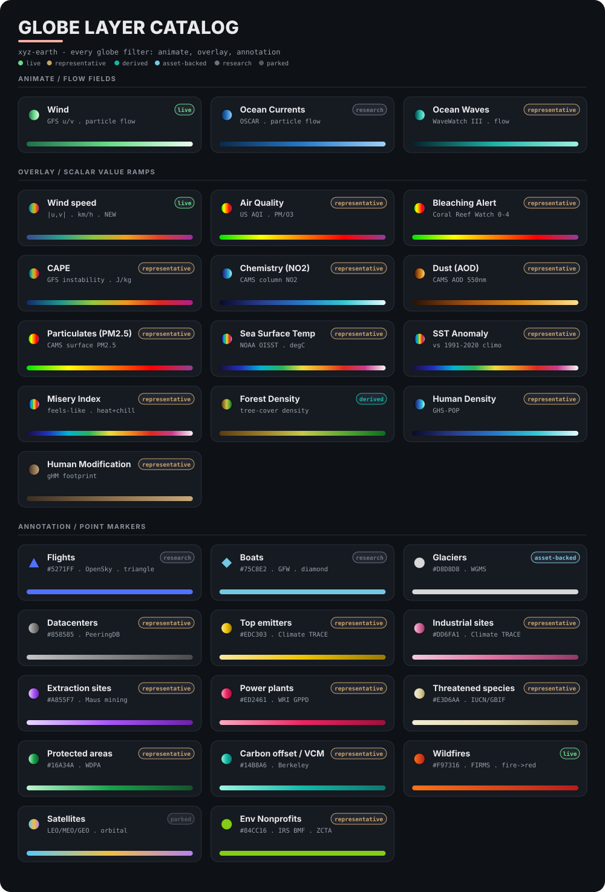

<!-- PROJECT LOGO -->
<br />
<div align="center">
  
<h3 align="center" style="color:#ff4124">Random Knights | Earth+</h3>
  <p align="center">
    🏫 <a href="https://rand0m.ai">rand0m.ai</a> 2025-2030 🛸 roswell, ga 🍑 <a href="https://randomknights.xyz">ᴚk.xyz</a> + <a href="https://randomknights.llc">ᴚk.llc</a> + <a href="https://randomknights.org">ᴚk.org</a> 🏰
    <br />
    🌝 <a href="https://randomly.engineering">randomly.engineering</a> & <a href="https://knightly.engineering">knightly.engineering</a> 🌚
    <br />
    <br />
    <a href="https://github.com/random-knights/.github/blob/main/READMORE"><strong>Explore the docs »</strong></a>
    <br />
    <br />
    <a href="https://github.com/random-knights/ruok">View Demo</a>
    ·
    <a href="https://github.com/random-knights/123/issues">Report Bug</a>
    ·
    <a href="https://github.com/random-knights/123/issues">Request Feature</a>
  </p>
</div>

# xyz-earth

> The living globe for [rand0m.ai](https://rand0m.ai) is **keyless, open-source, clone-and-run.**

A self-contained Flutter web app that renders Earth's real environmental signals
as an animated globe with a **Planet Health Score**. It reads public rand0m.ai
Storage over plain HTTPS and ships with bundled representative data, so it
**always renders offline**: **no keys, no auth, no Firebase, no private
dependencies.**

---

## Run it (60 seconds)

**Prerequisites:** the [Flutter SDK](https://docs.flutter.dev/get-started/install)
(stable, Dart ≥ 3.6) and Chrome.

One command from a fresh clone:

```bash
git clone https://github.com/random-knights/xyz-earth.git && cd xyz-earth && flutter run -d chrome
```

(`flutter run` fetches dependencies itself; no accounts, no keys, no `.env`.)

That's the whole setup. The globe boots from bundled representatives and upgrades
to live data wherever a public rand0m.ai Storage object exists. There is nothing
to configure and no secret to provide.

Build a static bundle (e.g. to host or to attach to a Release):

```bash
flutter build web
# output in build/web/
```

### What you can do

- Toggle an **Animate** layer (wind / ocean currents / waves), a scalar
  **Overlay** (SST, air quality, forest, …), and a **Points** layer (wildfires,
  glaciers, power plants, …).
- Read the **Planet Health Score** ring (global) and open the **History** panel
  for the daily score over time.
- **HD** raises the flow-field particle budget; **Spin** auto-rotates the globe.

---

## How it stays keyless

The viewer reads the public rand0m.ai Storage bucket directly:

```
https://storage.googleapis.com/randomknights-xyz.firebasestorage.app/<object>
```

- **Score:** `earth/score/health-score.json` · history `earth/score/health-history.json`
- **Scalar grids** (`earth.scalarfield.v1`): `earth/<layer>/...-grid.json`
- **Point sets** (`earth.pointset.v1`, identity-stripped): wildfire, biodiversity, …

Each source tries the public live object and, on **any** failure (offline, a
not-yet-deployed object, a non-public 403), falls back to the **bundled
representative** asset under `assets/earth/`. The app never crashes and never
blocks on auth. A `live-ready` manifest skips fetches for objects known to be
undeployed, and every live fetch has a timeout.

> The score math is **frozen at v0.7** (owner-ratified). This app only reads and
> displays the score document. It never recomputes or alters it.

---

<div align="center">

[](preview/earth2d-wind-globe.html)

<sub><b>2D globe (<code>earth2d</code>), wind layer.</b> Static preview · <a href="preview/earth2d-wind-globe.html"><b>open the interactive mock »</b></a> (drag to rotate). Illustrative wind field, not live data.</sub>

</div>

## Planet Health Score v0.7

A single number per region and globally, blending nine Earth-system domains. It
is an estimate, not a certified assessment; every signal carries a confidence
label.

<div align="center">
  
| Domain | What it measures | Primary source |
| --- | --- | --- |
| **Land** | Tree-cover health, forest loss rate | GLAD Hansen / VCF5KYR |
| **Fire** | Active hotspot burden, 24 h window | NASA FIRMS |
| **Atmosphere** | Air-quality burden, AQI-weighted | CAMS |
| **Ocean temperature** | SST anomaly vs 1991-2020 WMO baseline | NOAA OISST / Open-Meteo Marine |
| **Ocean acidification** | pH trend stress signal | _(open for proposals)_ |
| **Cryosphere** | Sea-ice extent and anomaly | _(expanding)_ |
| **Biodiversity** | Species pressure / habitat integrity proxy | GBIF |
| **Conservation** | Protected-area coverage signal | IUCN / WDPA |
| **Anthroposphere** | Human-pressure index (gHM-grounded) | Global Human Modification index |

</div>

Domains are anchored against **planetary boundary thresholds** (Rockström et al.).
Signals within a domain are averaged; each domain contributes once to the global
score. Normalizers are locked at ratification (anchored), not floating with
observed ranges.

v0.7 adds two honesty refinements: **protected-areas de-saturation** (coverage is
scored on a saturating curve that treats the 30×30 target as a safe floor, not a
perfect score) and a **humility ceiling** (every domain's health is softly
compressed above 90 so no domain can ever read as a "solved" 100). The bundled
representative asset mirrors the live v0.7 document and is guarded against
methodology drift by `test/score_asset_drift_guard_test.dart`.

---

## Layer catalog

Every globe filter, **Animate** (flow), **Overlay** (scalar value-ramps), and **Annotation** (point markers), includes its live status and the exact palette the renderer uses:

<div align="center">



</div>

The newest annotation layer is **Environmental Nonprofits** (US): the IRS Exempt
Organizations Business Master File located via US Census ZCTA ZIP centroids,
both US-government public domain (attribution as courtesy, no share-alike). Like
every bundled layer it ships a representative offline sample (organizations
aggregated to coarse ZIP-code areas, never named) and upgrades to live data when
the nonprofits ingest publishes its snapshot.

---

## Governance

Everything you see is **aggregated** and **identity-free** by design:

- No callsigns, vessel names, tail numbers, registrations, or personal
  identifiers, ever. Identity suppression is a property of the data, not a
  display-time filter.
- No precise sensitive locations. Ambient mobility layers (flights, boats) are
  decimated and rendered non-interactive (flow, not followable targets).
- Open scientific sources only, each carrying its provider's license.

Contributors must keep this bar. See [CONTRIBUTING.md](CONTRIBUTING.md) and
the [Code of Conduct](CODE_OF_CONDUCT.md). The
`test/keyless_guard_test.dart` gate proves the tree stays free of secrets, auth
SDKs, and private dependencies.

---

## Join the research

[**Discussions →**](../../discussions): score methodology, data-source
proposals, license questions, and layer requests.

---

## License & attribution

- **Code:** [MIT](LICENSE).
- **Methodology & governance docs:** CC BY 4.0.
- **Brand assets** (the rand0m logo/header, brand colours beyond the few inlined
  UI tokens): **reserved, not covered by the MIT code license**. See
  [`NOTICE`](NOTICE). The app's runtime does not depend on the brand logo.
- **Upstream data & bundled third-party code:** each carries its provider's
  license. See [`NOTICE`](NOTICE) (NOAA, NASA, CAMS, GLAD, IUCN/WDPA, Natural
  Earth, gHM, WRI, d3/topojson, …).

## Operating this repo

- [RUNBOOK.md](RUNBOOK.md) - humans: how to ship a Release, roll back, why this
  repo is keyless, what breaks and how to fix it.
- [AGENTS.md](AGENTS.md) - agents: the rules that apply in this repo.

<!----------- BADGES ----------->

<!-- TECHNOLOGY -->

## <span style="color:#555555"><u> **TECHNOLOGY** </u></span>

<!-- ### **Workspace**

[![Windows][Windows]][Windows-url]
[![Nvidia][Nvidia]][Nvidia-url]
[![Ryzen][Ryzen]][Ryzen-url] -->

### **CLI**

[![GitBash][GitBash]][GitBash-url]
[![Herdr][Herdr]][Herdr-url]
[![Powershell][Powershell]][Powershell-url]

### **IDE**

[![VSCode][VSCode]][VSCode-url]

### **Source Control**

[![GitHub][GitHub]][GitHub-url]
[![Git][Git]][Git-url]

### **Database**

[![HiveDB][HiveDB]][HiveDB-url]
[![MongoDB][MongoDB]][MongoDB-url]
[![PostgreSQL][PostgreSQL]][PostgreSQL-url]

### **Tools**

[![CodexMicropad][CodexMicropad]][CodexMicropad-url]
[![TeenageEngineeringMic][TeenageEngineeringMic]][TeenageEngineeringMic-url]
[![NothingHeadphones][NothingHeadphones]][NothingHeadphones-url]
[![RaspberryPi][RaspberryPi]][RaspberryPi-url]

### **Development**

[![Node.js][Node.js]][Node-url]
[![Python][Python]][Python-url]
[![JavaScript][JavaScript]][JavaScript-url]
[![TypeScript][TypeScript]][TypeScript-url]
[![Flutter][Flutter]][Flutter-url]
[![Dart][Dart]][Dart-url]

### **Testing**

[![Chai.js][Chai.js]][Chai-url]
[![Cucumber][Cucumber]][Cucumber-url]
[![Cypress.js][Cypress.js]][Cypress-url]
[![Jest][Jest]][Jest-url]
[![Lighthouse][Lighthouse]][Lighthouse-url]
[![Mocha.js][Mocha.js]][Mocha-url]
[![Swagger.js][Swagger.js]][Swagger-url]
[![TestLibrary][TestLibrary]][TestLibrary-url]

### **AI**

[![OpenAI][OpenAI]][OpenAI-url]
[![Gemini][Gemini]][Gemini-url]
[![Claude][Claude]][Claude-url]
[![RabbitTech][RabbitTech]][RabbitTech-url]
[![Perplexity][Perplexity]][Perplexity-url]
[![Rand0mAI][Rand0mAI]][Rand0mAI-url]
[![HuggingFace][HuggingFace]][HuggingFace-url]
[![Ollama][Ollama]][Ollama-url]

### **Design**

[![AdobeIllustrator][AdobeIllustrator]][Illustrator-url]
[![Canva][Canva]][Canva-url]
[![Figma][Figma]][Figma-url]

### **Pipelines**

[![GoogleCloud][GoogleCloud]][GoogleCloud-url]
[![GitHubActions][GitHubActions]][GitHubActions-url]
[![Firebase][Firebase]][Firebase-url]
[![Jira][Jira]][Jira-url]
[![Slack][Slack]][Slack-url]

### **Research & Funding**

<div align="center">

[![ORCiD][ORCiD]][ORCiD-url]
[![OpenCollective][OpenCollective]][OpenCollective-url]

</div>

<p align="right">(<a href="#readme-top">back to top</a>)</p>

<div align="center">
  🏰🛏️🌚ɯ0puɐɹ  kn1ghts🌝🛋️🏫
</div>

<!-- MARKDOWN LINKS & IMAGES -->
<!-- https://www.markdownguide.org/basic-syntax/#reference-style-links -->
<!-- DAY PALETTE GRADIENT PATCH -->
<!-- #ff4124 #faafa5 #fadfdb #b1fec8 -->
<!-- NIGHT PALETTE GRADIENT PATCH -->
<!-- #723848 #ad7a88 #e5bec8 #6fcf8c -->

[contributors-shield]: https://img.shields.io/github/contributors/repo_name.svg?style=for-the-badge
[contributors-url]: https://github.com/random-knights/random-graphs/contributors
[forks-shield]: https://img.shields.io/github/forks/repo_name.svg?style=for-the-badge
[forks-url]: https://github.com/random-knights/random-network/members
[stars-shield]: https://img.shields.io/github/stars/repo_name.svg?style=for-the-badge
[stars-url]: https://github.com/random-knights/stargazers
[issues-shield]: https://img.shields.io/github/issues/repo_name.svg?style=for-the-badge
[issues-url]: https://github.com/random-knights/random-issues
[license-shield]: https://img.shields.io/github/license/repo_name.svg?style=for-the-badge
[license-url]: https://github.com/random-knights/random/blob/master/LICENSE.txt
[linkedin-shield]: https://img.shields.io/badge/LinkedIn-0A66C2?style=for-the-badge&logo=linkedin&logoColor=white
[linkedin-url]: https://linkedin.com/company/random-knights

<!-- WORKSPACE (C1: ff4124) -->

[Nvidia]: https://img.shields.io/badge/NVIDIA-RTX3060-ff4124?style=for-the-badge&logo=nvidia&logoColor=white
[Nvidia-url]: https://www.nvidia.com/en-us/
[Ryzen]: https://img.shields.io/badge/AMD-Ryzen_7_5800H-ff4124?style=for-the-badge&logo=amd&logoColor=white
[Ryzen-url]: https://www.amd.com/en/processors/ryzen
[Windows]: https://img.shields.io/badge/Windows-Lenovo_Legion-ff4124?style=for-the-badge&logo=windows&logoColor=white
[Windows-url]: https://www.lenovo.com/us/en/
[Macbook]: https://img.shields.io/badge/Apple-MacBook_Pro_2022-000000?style=for-the-badge&logo=apple&logoColor=white
[Macbook-url]: https://www.apple.com/macbook-pro/

<!-- CLI (C1: 8855ff) -->

[GitBash]: https://img.shields.io/badge/GitBash-8855ff?style=for-the-badge&logo=git&logoColor=white
[GitBash-url]: https://git-scm.com/
[Herdr]: https://img.shields.io/badge/Herdr-8855ff?style=for-the-badge&logo=herdr&logoColor=white
[Herdr-url]: https://herdr.dev/
[Powershell]: https://img.shields.io/badge/Powershell-8855ff?style=for-the-badge&logo=power-shell&logoColor=white
[Powershell-url]: https://apps.microsoft.com/detail/9mz1snwt0n5d?hl=en-US&gl=US

<!-- IDE (C1: ff4124) -->

[VSCode]: https://img.shields.io/badge/Visual_Studio_Code-ff4124?style=for-the-badge&logo=visualstudiocode&logoColor=white
[VSCode-url]: https://code.visualstudio.com/

<!-- SOURCE CONTROL (C2: faafa5) -->

[GitHub]: https://img.shields.io/badge/GitHub-faafa5?style=for-the-badge&logo=github&logoColor=white
[GitHub-url]: https://github.com/
[Git]: https://img.shields.io/badge/Git-faafa5?style=for-the-badge&logo=git&logoColor=white
[Git-url]: https://git-scm.com/

<!-- DATABASE (C2: faafa5) -->

[MongoDB]: https://img.shields.io/badge/MongoDB-faafa5?style=for-the-badge&logo=mongodb&logoColor=white
[MongoDB-url]: https://www.mongodb.com/
[PostgreSQL]: https://img.shields.io/badge/PostgreSQL-faafa5?style=for-the-badge&logo=postgresql&logoColor=white
[PostgreSQL-url]: https://www.postgresql.org/
[HiveDB]: https://img.shields.io/badge/Hive-faafa5?style=for-the-badge&logo=apachehive&logoColor=white
[HiveDB-url]: https://pub.dev/packages/hive

<!-- TOOLS (C2: ad7a88) -->

[CodexMicropad]: https://img.shields.io/badge/Open_AI-Codex--Micro-ad7a88?style=for-the-badge&logoColor=white
[CodexMicropad-url]: https://openai.com/supply/co-lab/work-louder/
[TeenageEngineeringMic]: https://img.shields.io/badge/Teenage_Engineering-CM--15_Mic-ad7a88?style=for-the-badge&logoColor=white
[TeenageEngineeringMic-url]: https://teenage.engineering/products/cm-15
[NothingHeadphones]: https://img.shields.io/badge/Nothing-Headphone_(1)-ad7a88?style=for-the-badge&logoColor=white
[NothingHeadphones-url]: https://nothing.tech/products/headphone-1
[RaspberryPi]: https://img.shields.io/badge/Raspberry_Pi-ad7a88?style=for-the-badge&logo=raspberrypi&logoColor=white
[RaspberryPi-url]: https://www.raspberrypi.com/

<!-- DEVELOPMENT BADGES -->

[ForDevs]: https://forthebadge.com/images/badges/built-by-developers.svg
[ForDevs-url]: https://forthebadge.com
[ForQAs]: https://forthebadge.com/api/badges/generate?panels=2&primaryLabel=TESTED+BY&secondaryLabel=ENGINEERS&primaryBGColor=%23ff4124&secondaryBGColor=%23faafa5&primaryTextColor=%23FFFFFF&primaryFontSize=12&primaryFontWeight=600&primaryLetterSpacing=2&primaryFontFamily=Roboto&primaryTextTransform=uppercase&secondaryTextColor=%23FFFFFF&secondaryFontSize=12&secondaryFontWeight=900&secondaryLetterSpacing=2&secondaryFontFamily=Montserrat&secondaryTextTransform=uppercase&secondaryIcon=testinglibrary&secondaryIconColor=%23FFFFFF&secondaryIconSize=16&secondaryIconPosition=right
[ForQAs-url]: https://forthebadge.com
[ForScience]: https://forthebadge.com/images/badges/built-with-science.svg
[ForScience-url]: https://forthebadge.com
[JavaScript]: https://img.shields.io/badge/JavaScript-e5bec8?style=for-the-badge&logo=javascript&logoColor=white
[JavaScript-url]: https://www.javascript.com/
[Node.js]: https://img.shields.io/badge/Node.js-e5bec8?style=for-the-badge&logo=node.js&logoColor=white
[Node-url]: https://nodejs.org/
[Python]: https://img.shields.io/badge/Python-e5bec8?style=for-the-badge&logo=python&logoColor=white
[Python-url]: https://www.python.org/
[TypeScript]: https://img.shields.io/badge/TypeScript-e5bec8?style=for-the-badge&logo=typescript&logoColor=white
[TypeScript-url]: https://www.typescriptlang.org/
[Flutter]: https://img.shields.io/badge/Flutter-e5bec8?style=for-the-badge&logo=flutter&logoColor=white
[Flutter-url]: https://flutter.dev/
[Dart]: https://img.shields.io/badge/Dart-e5bec8?style=for-the-badge&logo=dart&logoColor=white
[Dart-url]: https://dart.dev/

<!-- TESTING (C3: fadfdb) -->

[Chai.js]: https://img.shields.io/badge/Chai-fadfdb?style=for-the-badge&logo=chai&logoColor=white
[Chai-url]: https://www.chaijs.com/
[Cucumber]: https://img.shields.io/badge/Cucumber-fadfdb?style=for-the-badge&logo=cucumber&logoColor=white
[Cucumber-url]: https://cucumber.io/
[Cypress.js]: https://img.shields.io/badge/Cypress-fadfdb?style=for-the-badge&logo=cypress&logoColor=white
[Cypress-url]: https://www.cypress.io/
[Jest]: https://img.shields.io/badge/Jest-fadfdb?style=for-the-badge&logo=jest&logoColor=white
[Jest-url]: https://jestjs.io/
[Lighthouse]: https://img.shields.io/badge/Lighthouse-fadfdb?style=for-the-badge&logo=lighthouse&logoColor=white
[Lighthouse-url]: https://developer.chrome.com/docs/lighthouse/
[Mocha.js]: https://img.shields.io/badge/Mocha-fadfdb?style=for-the-badge&logo=mocha&logoColor=white
[Mocha-url]: https://mochajs.org/
[Swagger.js]: https://img.shields.io/badge/Swagger-fadfdb?style=for-the-badge&logo=swagger&logoColor=white
[Swagger-url]: https://swagger.io/
[TestLibrary]: https://img.shields.io/badge/Testing_Library-fadfdb?style=for-the-badge&logo=testing-library&logoColor=white
[TestLibrary-url]: https://testing-library.com/

<!-- DESIGN (C4: b1fec8) -->

[AdobeIllustrator]: https://img.shields.io/badge/Adobe_Illustrator-b1fec8?style=for-the-badge&logo=adobeillustrator&logoColor=black
[Illustrator-url]: https://www.adobe.com/products/illustrator.html
[Canva]: https://img.shields.io/badge/Canva-b1fec8?style=for-the-badge&logo=canva&logoColor=white
[Canva-url]: https://www.canva.com/
[Figma]: https://img.shields.io/badge/Figma-b1fec8?style=for-the-badge&logo=figma&logoColor=white
[Figma-url]: https://www.figma.com/
[Framer]: https://img.shields.io/badge/Framer-b1fec8?style=for-the-badge&logo=framer&logoColor=blue
[Framer-url]: https://www.framer.com/

<!-- PIPELINE (C4: 6fcf8c) -->

[Slack]: https://img.shields.io/badge/Slack-6fcf8c?style=for-the-badge&logo=slack&logoColor=orange
[Slack-url]: https://www.slack.com/
[CypressCloud]: https://img.shields.io/badge/Cypress_Cloud-6fcf8c?style=for-the-badge&logo=cypress&logoColor=orange
[CypressCloud-url]: https://www.cypress.io/
[Firebase]: https://img.shields.io/badge/Firebase-6fcf8c?style=for-the-badge&logo=firebase&logoColor=orange
[Firebase-url]: https://firebase.google.com/
[GitHubActions]: https://img.shields.io/badge/GitHub_Actions-6fcf8c?style=for-the-badge&logo=github-actions&logoColor=orange
[GitHubActions-url]: https://github.com/features/actions
[GoogleCloud]: https://img.shields.io/badge/Google_Cloud-6fcf8c?style=for-the-badge&logo=google-cloud&logoColor=orange
[GoogleCloud-url]: https://cloud.google.com
[Jira]: https://img.shields.io/badge/Jira-6fcf8c?style=for-the-badge&logo=jira&logoColor=orange
[Jira-url]: https://www.atlassian.com/software/jira

<!-- AI (C4: b1fec8) -->

[OpenAI]: https://img.shields.io/badge/OpenAI-b1fec8?style=for-the-badge&logo=openaigym&logoColor=white
[OpenAI-url]: https://openai.com/
[Gemini]: https://img.shields.io/badge/Gemini-b1fec8?style=for-the-badge&logo=google&logoColor=white
[Gemini-url]: https://gemini.google.com/
[Claude]: https://img.shields.io/badge/Claude-b1fec8?style=for-the-badge&logo=anthropic&logoColor=white
[Claude-url]: https://www.anthropic.com/
[RabbitTech]: https://img.shields.io/badge/Rabbit.Tech-FF4124?style=for-the-badge
[RabbitTech-url]: https://www.rabbit.tech/
[Perplexity]: https://img.shields.io/badge/Perplexity-b1fec8?style=for-the-badge&logo=perplexity&logoColor=white
[Perplexity-url]: https://www.perplexity.ai/
[Rand0mAI]: https://img.shields.io/badge/Rand0m.AI-FF4124?style=for-the-badge
[Rand0mAI-url]: https://rand0m.ai/
[HuggingFace]: https://img.shields.io/badge/HuggingFace-b1fec8?style=for-the-badge&logo=huggingface&logoColor=white
[HuggingFace-url]: https://www.huggingface.co/
[Ollama]: https://img.shields.io/badge/Ollama-b1fec8?style=for-the-badge&logo=ollama&logoColor=white
[Ollama-url]: https://www.ollama.com/

<!-- AI (C4: b1fec8) -->

[OpenCollective]: https://img.shields.io/badge/OpenCollective-edc303?style=for-the-badge&logo=opencollective&logoColor=white
[OpenCollective-url]: https://opencollective.com/random-knights
[ORCiD]: https://img.shields.io/badge/ORCiD-edc303?style=for-the-badge&logo=orcid&logoColor=white
[ORCiD-url]: https://orcid.org/0009-0006-5066-1693

